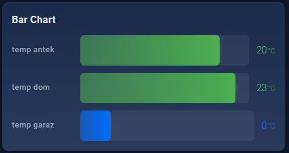
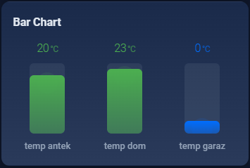
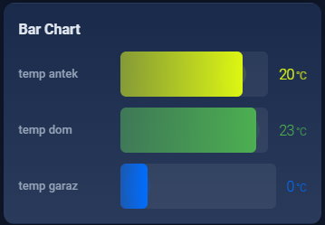

# Animated Bar Card

[](https://github.com/hacs/integration)
[](https://opensource.org/licenses/MIT)
[](https://github.com/smalarz/animated-bar-card)

A beautiful and animated bar chart card for Home Assistant with smooth transitions, severity-based colors, and support for both horizontal and vertical layouts.





## Features

- 🎨 **Multiple entities** — Display multiple bars in a single card
- 🌈 **Severity-based colors** — Automatic color gradients based on value thresholds
- ✨ **Smooth animations** — Bars animate from 0 to value with ease-out cubic transitions (~800ms)
- 📊 **Horizontal & Vertical layouts** — Choose the direction that fits your dashboard
- 🎯 **Per-entity customization** — Individual colors, labels, min/max, decimals, units, and icons
- 🔢 **Value display** — Show numeric values with customizable units and decimal places
- 🏷️ **Labels & Icons** — Display entity names and icons alongside bars
- 🎭 **Fully themed** — Integrates with Home Assistant themes
- ⚡ **No dependencies** — Single vanilla JavaScript file, no build tools required
- 🌍 **Multi-language** — English, Polish, and German translations

## Installation

### HACS (Recommended)

1. Open HACS in Home Assistant
2. Go to "Frontend"
3. Click the menu (three dots) in the top right corner
4. Select "Custom repositories"
5. Add `https://github.com/smalarz/animated-bar-card` as a repository
6. Category: `Lovelace`
7. Click "Add"
8. Find "Animated Bar Card" in the list and click "Install"
9. Restart Home Assistant

### Manual Installation

1. Download `animated-bar-card.js` from the [latest release](https://github.com/smalarz/animated-bar-card/releases)
2. Copy the file to `<config>/www/animated-bar-card.js`
3. Add a resource reference in your Lovelace configuration:

```yaml
resources:
  - url: /local/animated-bar-card.js
    type: module
```

4. Restart Home Assistant

## Configuration

### Minimal Example

```yaml
type: custom:animated-bar-card
entities:
  - sensor.cpu_usage
  - sensor.memory_usage
  - sensor.disk_usage
```

### Full Example

```yaml
type: custom:animated-bar-card
name: System Resources
min: 0
max: 100
unit: '%'
decimals: 1
direction: horizontal
bar_height: 20
bar_spacing: 12
animation_duration: 800
show_value: true
show_name: true
show_icon: true
show_header: true
severity:
  - from: 0
    to: 50
    color: '#4caf50'
  - from: 50
    to: 80
    color: '#ff9800'
  - from: 80
    to: 100
    color: '#f44336'
entities:
  - entity: sensor.cpu_usage
    name: CPU
    icon: mdi:cpu-64-bit
    color: '#3b82f6'
  - entity: sensor.memory_usage
    name: Memory
    icon: mdi:memory
    min: 0
    max: 16
    unit: GB
    decimals: 2
  - entity: sensor.disk_usage
    name: Disk
    icon: mdi:harddisk
```

### Vertical Layout Example

```yaml
type: custom:animated-bar-card
name: Energy Production
direction: vertical
columns: 3
bar_height: 30
entities:
  - entity: sensor.solar_power
    name: Solar
    icon: mdi:solar-power
    color: '#fbbf24'
  - entity: sensor.wind_power
    name: Wind
    icon: mdi:weather-windy
    color: '#06b6d4'
  - entity: sensor.grid_power
    name: Grid
    icon: mdi:transmission-tower
    color: '#8b5cf6'
```

## Options

### Card Options

| Option | Type | Default | Description |
|--------|------|---------|-------------|
| `entities` | list | **required** | List of entity objects or entity IDs |
| `name` | string | - | Card title (header) |
| `min` | number | `0` | Global minimum value |
| `max` | number | `100` | Global maximum value |
| `unit` | string | - | Global unit override |
| `decimals` | number | `0` | Number of decimal places |
| `direction` | string | `horizontal` | Bar direction: `horizontal` or `vertical` |
| `bar_height` | number | `20` | Bar thickness in pixels |
| `bar_spacing` | number | `12` | Gap between bars in pixels |
| `animation_duration` | number | `800` | Animation duration in milliseconds |
| `columns` | number/string | `auto` | Number of columns for vertical layout |
| `show_value` | boolean | `true` | Show numeric values |
| `show_name` | boolean | `true` | Show entity labels |
| `show_icon` | boolean | `true` | Show entity icons |
| `show_header` | boolean | `true` | Show card name header |
| `severity` | list | default thresholds | Color severity thresholds |

### Entity Options

Each entity can be a string (entity ID) or an object with these properties:

| Option | Type | Default | Description |
|--------|------|---------|-------------|
| `entity` | string | **required** | Entity ID |
| `name` | string | entity name | Custom label |
| `label` | string | entity name | Alias for `name` |
| `color` | string | severity color | Custom bar color (hex) |
| `icon` | string | entity icon | Custom icon |
| `min` | number | global min | Entity-specific minimum |
| `max` | number | global max | Entity-specific maximum |
| `unit` | string | global unit | Entity-specific unit |
| `decimals` | number | global decimals | Entity-specific decimal places |

### Severity Thresholds

Default severity thresholds:

```yaml
severity:
  - from: 0
    to: 33
    color: '#4caf50'  # Green
  - from: 33
    to: 66
    color: '#ff9800'  # Orange
  - from: 66
    to: 100
    color: '#f44336'  # Red
```

## Sensors Setup

This card works with any numeric sensor. Here are some common examples:

### System Monitoring

```yaml
type: custom:animated-bar-card
name: System Monitor
entities:
  - sensor.processor_use
  - sensor.memory_use_percent
  - sensor.disk_use_percent
```

### Energy Monitoring

```yaml
type: custom:animated-bar-card
name: Energy Usage
unit: kWh
entities:
  - sensor.daily_energy
  - sensor.monthly_energy
  - sensor.yearly_energy
```

### Temperature Sensors

```yaml
type: custom:animated-bar-card
name: Room Temperatures
min: 15
max: 30
unit: °C
decimals: 1
entities:
  - sensor.living_room_temperature
  - sensor.bedroom_temperature
  - sensor.kitchen_temperature
```

### Battery Levels

```yaml
type: custom:animated-bar-card
name: Battery Status
unit: '%'
entities:
  - sensor.phone_battery
  - sensor.tablet_battery
  - sensor.laptop_battery
```

## Animation Details

The card uses `requestAnimationFrame` for smooth, 60fps animations:

- **Duration**: 800ms by default (customizable)
- **Easing**: Ease-out cubic for natural deceleration
- **Trigger**: Animates on initial load and whenever values change
- **Performance**: GPU-accelerated, minimal CPU usage

## Theming

The card respects Home Assistant theme variables:

```css
--primary-text-color       /* Text color */
--secondary-text-color     /* Label and unit color */
--card-background-color    /* Card background */
--secondary-background-color /* Editor blocks */
--divider-color           /* Borders */
--primary-color           /* Editor accents */
--error-color             /* Remove buttons */
--ha-card-border-radius   /* Card rounding */
```

You can also customize bar colors globally via severity thresholds or per-entity via the `color` option.

## Languages

The card includes translations for:

- 🇬🇧 **English** (en)
- 🇵🇱 **Polish** (pl)
- 🇩🇪 **German** (de)

The card automatically uses your Home Assistant language setting.

## Troubleshooting

### Bars don't animate

- Check that the sensor is numeric
- Verify the sensor state is not `unavailable` or `unknown`
- Ensure `min` and `max` values are correct

### Values not showing

- Confirm `show_value: true` is set (default)
- Check that the entity exists and has a valid state
- Verify the sensor has a numeric value

### Colors not working

- Ensure severity thresholds are configured correctly
- Check that `from` and `to` values cover the sensor's range
- Verify color codes are valid hex colors (e.g., `#ff0000`)

### Editor not appearing

- Refresh your browser cache (Ctrl+F5)
- Verify the card is properly installed
- Check browser console for errors

## Credits

Part of the **Animated Cards Collection** for Home Assistant:

- [Animated Weather Card](https://github.com/smalarz/animated-weather-card) — Weather forecast with animated icons
- [Animated Graph Card](https://github.com/smalarz/animated-graph-card) — Line/area charts with smooth transitions
- [Animated Plant Card](https://github.com/smalarz/animated-plant-card) — Plant monitoring with visual indicators
- [Animated Gauge Card](https://github.com/smalarz/animated-gauge-card) — Gauge/speedometer with needle
- [Animated Pie Card](https://github.com/smalarz/animated-pie-card) — Pie/donut charts with hover effects
- [Animated Commute Card](https://github.com/smalarz/animated-commute-card) — Travel time with traffic visualization

## License

MIT License - see [LICENSE](LICENSE) file for details

## Support

If you like this card, please ⭐ star the repository and consider supporting the development:

- Report issues on [GitHub Issues](https://github.com/smalarz/animated-bar-card/issues)
- Contribute improvements via [Pull Requests](https://github.com/smalarz/animated-bar-card/pulls)

---

Made with ❤️ for the Home Assistant community